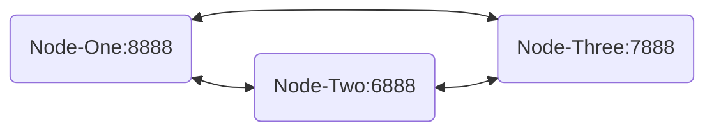

# Readme

## Purpose  
The TLDR; Quickly set up Antelope Software and see Savanna working with near instant finality.
See [Use Cases](doc/use-cases-private-network.md) for background.

## Topology

This reference and documentation sets up three separate nodes on a single host. Each node is a separate process distinguished with different port numbers.

## Quick Start Guide

- Build Docker Image
`./bin/docker-build-image.sh`
- Start Docker Container with Image
`./bin/docker-create-container.sh`
- Enter the Container
`./bin/docker-enter-container.sh`
- Setup Antelope Network
`/local/eosnetworkfoundation/repos/bootstrap-private-network/bin/finality_test_network.sh CREATE`
- See `last_irreversible_block_num` is many blocks behind `head_block_num`
`cleos get info`

The `last irreversible block` has been agreed to by the network, and can not be changed. This represents the last step in finalizing work across all the nodes. The head block has committed transactions that may be changed in the event of a bad actor, and error, or other synchronization issue.

- Activate Savanna
`/local/eosnetworkfoundation/repos/bootstrap-private-network/bin/finality_test_network.sh SAVANNA`
- See Last Irreversible Block is *-->three<--* block behind Head Block
`cleos get info`

The new algorithm is finalizing blocks faster. Even as producers scale up the SAVANNA algorithm will maintain the same 3 block delta between the `last_irreversible_block_num` and the `head_block_num`.

## Step By Step Documentation
See [Step By Step](doc/step-by-step.md)

## Frequently Asked Questions
Q: Why is nodeos version `5.1.0-dev`?
A: The current Savanna is in development as a branch of the `5.0` release. Proper release versions will be set as we get closer to releasing the software.
